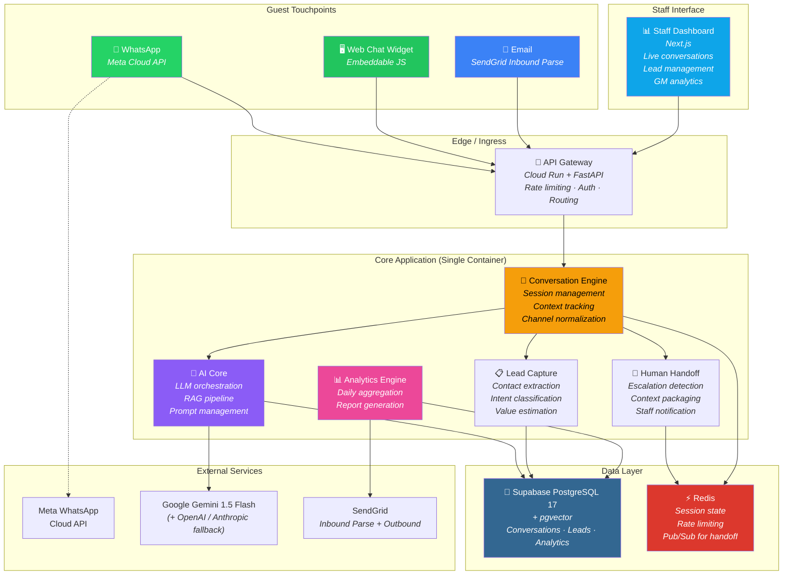
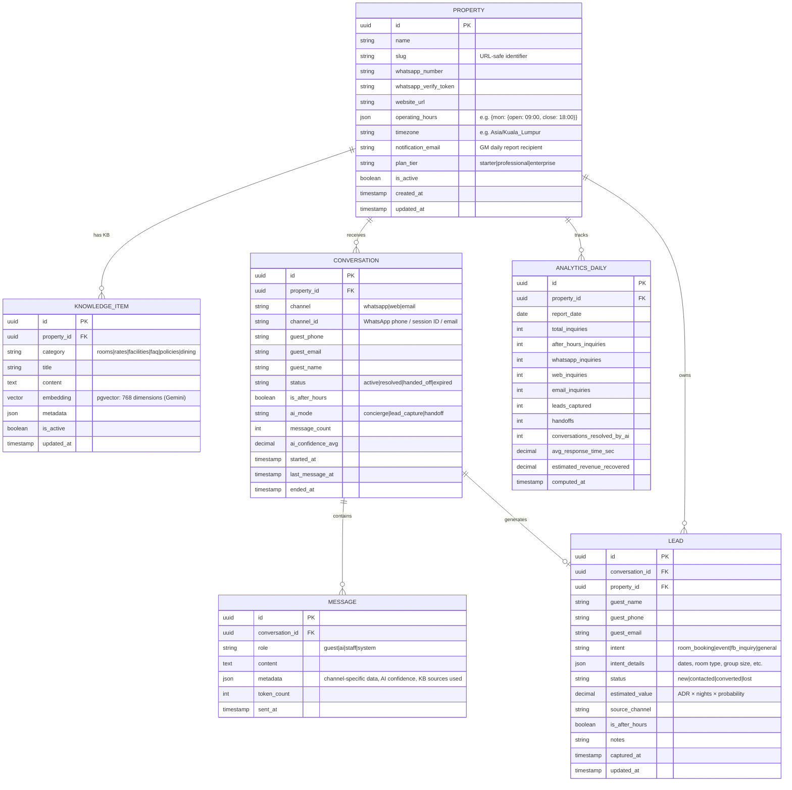
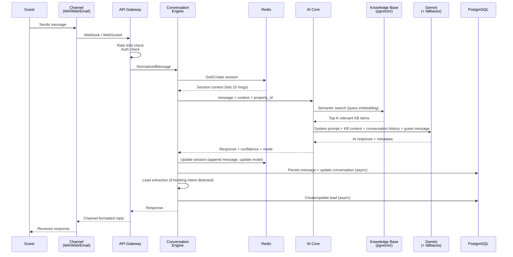
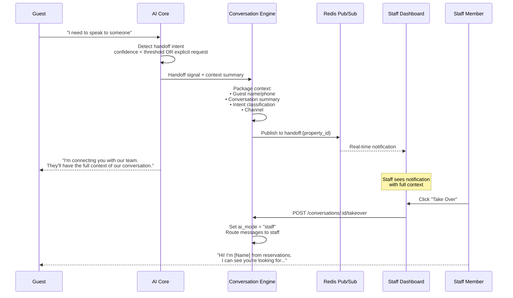
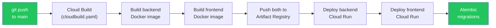

# System Architecture
## Nocturn AI — AI Inquiry Capture & Conversion Engine
### Version 2.2 · 23 Mar 2026
### Aligned with [product_context.md](./product_context.md) · Steered by [building-successful-saas-guide.md](./building-successful-saas-guide.md)
### Cross-referenced with: [portal_architecture.md](./portal_architecture.md), [prd.md](./prd.md) v2.1
### Implementation Status: v0.3.3 · All GCP compute spun down (2026-03-23) · Database: Supabase PostgreSQL 17 (ap-southeast-2)

---

## 1. Architecture Philosophy

This system is designed around **four non-negotiable constraints** derived from 20 years of building production systems at scale:

1. **Guest latency < 30 seconds end-to-end.** Every architectural decision optimizes for this. A guest sends a WhatsApp message at 11pm and gets a useful answer before they switch to Booking.com.
2. **Property data isolation from Day 1.** Property A's data never leaks to Property B. This is a trust product — one leak and every hotel cancels. (Note: full multi-tenant SaaS hierarchy — Tenant, TenantMembership, OnboardingProgress — is built but dormant in v1. Property-level isolation is the enforced guarantee.)
3. **Operational simplicity over architectural elegance.** This is a 2-person engineering team shipping in 28 days. No microservices. No Kubernetes. One backend, one database, auto-scaling containers.
4. **Observability from the start.** You cannot fix what you cannot measure. OpenTelemetry + metrics + alerting from day one. Set up alerts at 70% capacity thresholds.

---

## 2. High-Level Architecture



---

## 3. Design Decisions & Rationale

### 3.1 Monolith-First (Single Backend Container)

| Option Considered | Decision | Why |
|---|---|---|
| Microservices (separate conversation, AI, analytics services) | **Rejected** | 2-person team. 28-day deadline. Network overhead between services adds latency. Debugging distributed systems is a time sink. |
| Modular monolith (single FastAPI app, clean module boundaries) | **Chosen** | One deployment unit. Sub-millisecond inter-module calls. Can be split later if scale demands it (it won't for 100 properties). |

> At Google, we called this "monolith until it hurts." At 100 properties × 2,000 conversations/month, a single well-tuned container handles this easily. A Cloud Run instance with 2 vCPU and 4GB RAM can process ~50 concurrent conversations.

### 3.2 PostgreSQL + pgvector (No Separate Vector DB)

| Option Considered | Decision | Why |
|---|---|---|
| Pinecone / Qdrant (dedicated vector DB) | **Rejected for v1** | Extra service to manage. Extra cost. Sub-100ms latency is achievable with pgvector for our scale (<50k vectors per property). |
| PostgreSQL 16 + pgvector extension | **Chosen** | Single database for relational AND vector data. Simplifies ops. HNSW indexes give ~10ms retrieval. Transactional consistency between KB lookups and conversation writes. |

### 3.3 Redis for Session State (Not Database Sessions)

Conversations are multi-turn. The AI needs the last 5–10 messages as context for every response. Storing session state in Redis (not PostgreSQL) means:
- **Read latency**: ~1ms (Redis) vs ~5–10ms (PostgreSQL)
- **Write-behind**: Session updates are written to PostgreSQL asynchronously for persistence. Redis is the hot path.
- **TTL-based expiry**: Inactive sessions auto-expire after 30 minutes. No cleanup jobs.

> **v1 Production note:** No dedicated Memorystore for the pilot phase. `app/core/redis.py` falls back to a dict-based in-process store when Redis is unavailable or points to localhost. Sessions survive within a single Cloud Run instance but are **not shared across scale-out**. When scaling beyond 1 instance (>~50 concurrent conversations), provision Cloud Memorystore Redis Basic (1GB, ~RM 150/month) and set `REDIS_URL`.

### 3.4 Channel Normalization Pattern

All three channels (WhatsApp, Web, Email) produce different message formats. The Conversation Engine normalizes them into a single internal message format before processing:

```
┌─────────────┐     ┌──────────────────┐     ┌────────────────┐
│  WhatsApp    │────>│                  │     │                │
│  Webhook     │     │  Channel         │     │  Conversation  │
├─────────────┤     │  Normalizer      │────>│  Engine        │
│  Web Widget  │────>│                  │     │                │
│  WebSocket   │     │  Produces:       │     │  Sees:         │
├─────────────┤     │  NormalizedMsg {  │     │  One unified   │
│  Email       │────>│    channel       │     │  message type  │
│  Parse Hook  │     │    sender_id     │     │                │
└─────────────┘     │    content       │     └────────────────┘
                    │    metadata      │
                    │  }               │
                    └──────────────────┘
```

This is critical. The AI engine should never know or care what channel a message came from. Channel-specific behavior (e.g., WhatsApp message length limits, email threading) is handled at the edges.

### 3.5 Technical Debt Strategy

> *"Some debt is fine. But if every change risks breaking something, you've crossed the line. Plan for refactoring sprints."*

| Practice | Commitment |
|----------|------------|
| **Document shortcuts** | TODO comments with business threshold: `# TODO: Move to config when >50 customers` |
| **Refactoring cadence** | One refactoring sprint every 4–5 feature sprints |
| **Hardcoding v1** | Acceptable if it validates the business model faster. Track and schedule cleanup. |
| **Critical path testing** | Signup-to-payment flow: comprehensive automated tests. Everything involving money. |
| **SaaS infrastructure debt** | Tenant hierarchy, Stripe billing, Supabase Auth, SuperAdmin dashboard, gamified onboarding, support chatbot, application intake — all built ahead of validation. Dormant in v1. Do not activate until release conditions in PRD Section 9.2 are met. |

**Rule:** Technical perfectionism kills. Ship in 28 days. Iterate based on customer feedback.

### 3.6 API Design — External-First

Design the API as if external customers will use it from day one. This forces good architectural decisions.

- **Versioning:** `/api/v1` from day one. Never break v1; introduce v2 when needed.
- **Resource modeling:** RESTful with clear resource boundaries. Version in URL, not header.
- **Documentation:** OpenAPI/Swagger auto-generated from code. B2B: poor docs = churn.

---

## 4. Technology Stack

| Layer | Technology | Justification |
|---|---|---|
| **Backend API** | Python 3.12 + FastAPI | Async-native. LLM ecosystem is Python-first. Implemented and live. |
| **Database** | Supabase PostgreSQL 17 + pgvector | Hosted on Supabase (`ramenghkpvipxijhfptp`, ap-southeast-2). App connects as `nocturn_app` via transaction pooler (port 6543). `DATABASE_URL` from GCP Secret Manager — no hardcoded credentials. pgvector enabled natively. |
| **Cache / Sessions** | Redis 7 (graceful in-memory fallback) | Graceful dict-based fallback when Redis unavailable — allows Cloud Run to run without Memorystore for pilot phase. Sessions survive within a single instance. Pub/Sub is a no-op when Redis is absent. |
| **LLM Primary** | Google Gemini 1.5 Flash | Cost-effective, fast. Primary provider for conversation engine. Gemini roles mapped: `"assistant"` → `"model"`. |
| **LLM Fallback Chain** | OpenAI GPT-4o-mini → Anthropic Claude Haiku → template string | Ordered fallback. Empty responses from any provider fall through. Anthropic requires `system` prompt as separate param, not in messages array. |
| **Embeddings** | Gemini text-embedding-004 (768-dim) | `generate_embedding()` wraps synchronous client in `asyncio.to_thread()`. pgvector HNSW indexed on 768-dim vectors. |
| **Web Widget** | Vanilla JS + CSS (embeddable) | Zero dependencies for hotel. Single `<script>` tag. <50KB bundle. |
| **Staff Dashboard** | Next.js 14 (React) | SSR for performance. App Router for clean routing. Deployed to Cloud Run. |
| **Authentication** | Supabase Auth + local JWT | Supabase Auth (magic links, admin API) implemented. Local `User` record always created. Supabase gracefully skipped if env vars absent. `check_property_access()` for property routes, `check_tenant_access()` for tenant routes. |
| **Observability** | Structlog (structured logging) | Structlog implemented. OpenTelemetry + metrics/tracing as backlog (alert at 70% capacity thresholds). |
| **WhatsApp** | Meta WhatsApp Business Cloud API + Twilio | Both providers implemented. `Property.whatsapp_provider = "meta" | "twilio"`. Multi-tenant sender uses `prop.twilio_phone_number` (not global settings). |
| **Email** | SendGrid (Inbound Parse + Outbound) | Webhook for inbound. SMTP for outbound reports. Used by channel_setup, scheduler, onboarding. |
| **Payments** | Stripe *(dormant in v1)* | Checkout session + webhook stub implemented in `services/stripe_service.py`. Not activated — pilot invoicing is manual. Activate when ≥3 paying tenants confirmed. |
| **Infrastructure** | Google Cloud Run | Auto-scaling containers. Pay-per-use. Two services: backend + frontend. **Current state: spun down (2026-03-23) to save cost.** No Cloud SQL — DB is Supabase. |
| **CI/CD** | Google Cloud Build (`backend/cloudbuild.yaml`) | Builds both containers → Artifact Registry → deploys both Cloud Run services → runs Alembic migrations. Triggered manually or via Cloud Build GitHub trigger on `main`. |

---

## 4.5 SaaS Infrastructure — Activation Status

> **Status:** Multi-tenant SaaS hierarchy is built. The SheersSoft internal portal (`/admin`) is now active. The tenant self-service portals (`/portal`, `/welcome`) are not yet built. Do not activate customer-facing features until release conditions in PRD Section 9.2 are met. Full portal spec: [portal_architecture.md](./portal_architecture.md).

### Four-Portal Architecture

The frontend is structured as four distinct route groups in a single Next.js app:

| Portal | Route | Users | GTM Phase |
|--------|-------|-------|-----------|
| **Property Operations** | `/dashboard` | Hotel staff (daily use) | Phase 0 — must be right before any demo |
| **Internal Ops** | `/admin` | SheersSoft team only | Phase 1.5 — operational controls before multi-tenant scale |
| **Tenant Management** | `/portal` | Hotel owners/admins | Phase 4 — tenant self-service onboarding |
| **Onboarding Wizard** | `/welcome` | New hotel owners (first login) | Phase 4 — replaces manual SheersSoft-led setup |

Security boundary is enforced at the API level: `require_superadmin()` for `/admin`, `check_tenant_access()` for `/portal`, `check_property_access()` for `/dashboard`. Route separation is cosmetic until the client list grows.

The original design targeted a single-property pilot (Vivatel). Separately, the system was extended with a full multi-tenant SaaS hierarchy. This section documents what exists but is dormant.

### Tenant Hierarchy

```
Tenant (billing entity — hotel group)
  ├─ subscription_tier: "pilot" | "boutique" | "independent" | "premium"
  ├─ subscription_status: "trialing" | "active" | "cancelled" | "past_due"
  ├─ stripe_customer_id
  ├─ Property (one or many per tenant)
  │   ├─ all original models (Conversation, Message, Lead, KBDocument, AnalyticsDaily)
  │   └─ tenant_id, slug, plan_tier, is_active, deleted_at
  ├─ TenantMembership (user ↔ tenant with role)
  │   ├─ role: "owner" | "admin" | "staff"
  │   └─ accessible_property_ids: null=all, array=scoped
  └─ OnboardingProgress (per property — gamified milestone tracking)
      └─ channel statuses + milestone flags

User (1:1 with Supabase auth.users, is_superadmin for SheersSoft staff)
SupportTicket (tenant user → SheersSoft staff workflow)
Application (public intake at ai.sheerssoft.com/apply → converts to Tenant)
```

### Tenant Provisioning Flow

```
SuperAdmin → POST /api/v1/onboarding/provision-tenant
  → Creates Tenant + Property + User (Supabase Auth Admin API) + TenantMembership + OnboardingProgress
  → Sends magic link to new user
  → Background: _setup_channels_async() → updates OnboardingProgress per channel
```

### Authorization Layers

| Guard | Scope | Status | Used In |
|-------|-------|--------|---------|
| `require_superadmin()` | SheersSoft staff only (`a.basyir@sheerssoft.com`) | ✅ Active | All `/superadmin` routes, `/admin` portal |
| `check_tenant_access()` | TenantMembership, is_superadmin bypasses | ⚠️ Partially active — used in onboarding routes; full enforcement deferred to Phase 4 `/portal` | Tenant-level routes |
| `check_property_access()` | JWT property_id matching | ✅ Active | All property data routes (`/dashboard`) |

**Auth callback routing (target state — full implementation in Phase 4):**
```
is_superadmin=True          →  /admin
role=owner, onboarding=false →  /welcome
role=owner, onboarding=true  →  /portal
role=admin                   →  /portal
role=staff                   →  /dashboard
```
Current: `is_superadmin → /admin`, else → `/dashboard`. Full routing requires `onboarding_completed` flag on `User` (data model change — Phase 4).

### Internal Scheduler (Production)

In production, APScheduler is **disabled**. Cloud Scheduler calls internal endpoints instead.

> **Current state (2026-03-23):** Cloud Scheduler jobs were deleted during GCP cleanup. Must be recreated on next production deploy before scheduled jobs resume. The `/internal/*` endpoints are live and tested.
- `POST /api/v1/internal/run-daily-report`
- `POST /api/v1/internal/run-followups`
- `POST /api/v1/internal/run-insights`
- `POST /api/v1/internal/cleanup-leads`

All require `X-Internal-Secret` header. Excluded from OpenAPI docs.

---

## 5. Data Architecture

### 5.1 Entity Relationship Model



### 5.2 Property Data Isolation

Every query includes `property_id` as a mandatory filter. Implemented via:

1. **Row-Level Security (RLS)** on PostgreSQL — enforced at the database level, not just application level.
2. **API middleware** that extracts `property_id` from the authenticated session and injects it into every query.
3. **Knowledge base embeddings** are partitioned by `property_id` in the vector index. A RAG search for Property A never returns Property B's content.

### 5.3 Session State (Redis Schema)

```
# Active conversation session
conv:{conversation_id} → {
    property_id: uuid,
    channel: "whatsapp|web|email",
    guest_id: string,
    messages: [last 10 messages],  # Context window for LLM
    ai_mode: "concierge|lead_capture|handoff",
    lead_data: {partial lead info collected so far},
    last_activity: timestamp,
    ttl: 1800  # 30 min expiry
}

# Handoff notification channel
handoff:{property_id} → Pub/Sub channel for real-time staff alerts
```

---

## 6. Core Processing Flows

### 6.1 Guest Message Flow (All Channels)



**Target end-to-end latency budget:**

| Step | Budget | Notes |
|---|---|---|
| Channel → API Gateway | 50ms | Network latency |
| Rate limit + Auth | 10ms | Redis lookup |
| Session retrieval (Redis) | 5ms | In-memory |
| KB semantic search (pgvector) | 30ms | HNSW index |
| LLM API call (Gemini 1.5 Flash) | 600–1800ms | **Dominant cost.** Streaming reduces perceived latency. |
| Persistence (async) | 0ms on hot path | Written after response is sent |
| Response formatting + send | 50ms | Channel API call |
| **Total** | **~1–2 seconds** | Well within 30s target |

### 6.2 Human Handoff Flow



> **✅ Staff reply from dashboard is implemented.** Staff can type a reply in `/dashboard/conversations` and send it to the guest via the original channel (WhatsApp or web widget). Implemented in `backend/app/routes/staff.py` → `POST /api/v1/conversations/{id}/reply`. Done in v0.3.1.

### 6.3 After-Hours Detection

```python
# Simplified operating hours check
def is_after_hours(property: Property, timestamp: datetime) -> bool:
    local_time = timestamp.astimezone(property.timezone)
    day_schedule = property.operating_hours.get(local_time.strftime('%A').lower())
    if not day_schedule:
        return True  # No schedule = closed
    return not (day_schedule['open'] <= local_time.time() <= day_schedule['close'])
```

When `is_after_hours == True`:
- Conversation is flagged `is_after_hours = True`
- AI appends: *"Our reservations team will follow up first thing tomorrow morning."*
- Lead is created with `priority = high`
- Lead appears in the "After-Hours Recovery" section of the dashboard

---

## 7. AI / RAG Architecture

### 7.1 Knowledge Base Ingestion Pipeline
> **Note:** To support "Live in 48 Hours" (website promise), this pipeline must support rapid ingestion. SheersSoft team builds the KB from property info (rate card, FAQs) shared on Day 0. Supports bulk ingestion from raw formats (PDF, Docx, CSV) via admin CLI or scripts, converting to structured Markdown/JSON.

```
Property KB Document (Markdown/JSON/PDF/Docx)
    │
    ▼
┌───────────────────┐
│  Chunker          │  Split into ~500-token chunks
│  (recursive text) │  Overlap: 50 tokens
└───────┬───────────┘
        │
        ▼
┌───────────────────┐
│  Embedder         │  Gemini text-embedding-004
│  (768 dims)       │  Wrapped in asyncio.to_thread()
└───────┬───────────┘
        │
        ▼
┌───────────────────┐
│  PostgreSQL       │  INSERT into kb_documents (model: KBDocument)
│  + pgvector       │  HNSW index, cosine distance, scoped by property_id
└───────────────────┘
```

### 7.2 RAG Retrieval Strategy

1. **Embed** the guest's question using Gemini text-embedding-004 (768-dim), wrapped in `asyncio.to_thread()`.
2. **Vector search** against `kb_documents` WHERE `property_id = :pid` ORDER BY cosine distance (pgvector `<=>` operator), LIMIT 5.
3. **Relevance filter**: only include items with cosine similarity > 0.7.
4. **Inject** retrieved items into the LLM prompt as structured context.

### 7.3 Prompt Architecture

```
┌─────────────────────────────────────────────────┐
│ SYSTEM PROMPT                                    │
│ "You are a concierge for {property_name}..."    │
│ Bilingual: English + Bahasa Malaysia (auto-detect) │
│ Behavioral rules, guardrails, response format    │
├─────────────────────────────────────────────────┤
│ PROPERTY CONTEXT (from RAG)                      │
│ Retrieved KB items: rates, rooms, facilities     │
├─────────────────────────────────────────────────┤
│ CONVERSATION HISTORY (from Redis)                │
│ Last 10 messages for multi-turn context          │
├─────────────────────────────────────────────────┤
│ CURRENT MESSAGE                                  │
│ Guest's latest message                           │
└─────────────────────────────────────────────────┘
```

**Three AI Modes via System Prompt Variants:**

| Mode | Trigger | Prompt Behavior |
|---|---|---|
| **Concierge** | Default | Friendly, informative. Answers questions. Offers help. |
| **Lead Capture** | Booking intent detected (dates, "available?", "how much?") | Collect: name, dates, room preference, contact. Warm, not pushy. |
| **Handoff** | Guest requests human / complaint / complex request | Acknowledge, assure, prepare context summary for staff. |

---

## 8. API Design

### 8.1 Endpoint Specification

```
# ─── Channel Webhooks ───────────────────────────────
POST   /api/v1/webhook/whatsapp                 # Meta WhatsApp Cloud API webhook
GET    /api/v1/webhook/whatsapp                  # Webhook verification (GET challenge)
POST   /api/v1/webhook/email                     # SendGrid Inbound Parse

# ─── Web Widget Conversations ──────────────────────
POST   /api/v1/conversations                     # Start new web conversation
POST   /api/v1/conversations/{id}/messages       # Guest sends message
GET    /api/v1/conversations/{id}                # Get conversation + messages

# ─── Human Handoff ─────────────────────────────────
POST   /api/v1/conversations/{id}/handoff        # AI triggers handoff
POST   /api/v1/conversations/{id}/takeover       # Staff takes over
POST   /api/v1/conversations/{id}/resolve        # Staff resolves conversation

# ─── Lead Management ──────────────────────────────
GET    /api/v1/properties/{id}/leads             # List leads (filterable)
GET    /api/v1/leads/{id}                        # Lead detail
PATCH  /api/v1/leads/{id}                        # Update lead status/notes

# ─── Property Administration ──────────────────────
POST   /api/v1/properties                        # Onboard new property
GET    /api/v1/properties/{id}/settings          # Get property config
PUT    /api/v1/properties/{id}/knowledge-base    # Upload/update KB
POST   /api/v1/properties/{id}/onboard           # Self-serve onboarding flow

# ─── Analytics & Reports ──────────────────────────
GET    /api/v1/properties/{id}/analytics         # Dashboard data (date range)
GET    /api/v1/properties/{id}/analytics/summary # Key metrics for GM view
GET    /api/v1/properties/{id}/reports           # Generated reports list

# ─── Health ───────────────────────────────────────
GET    /api/v1/health                            # Liveness + dependency check

# ─── Staff Conversations (Dashboard) ──────────────
GET    /api/v1/properties/{id}/conversations     # List conversations
GET    /api/v1/conversations/{id}                # Conversation detail + messages
POST   /api/v1/conversations/{id}/reply          # Staff sends reply (forwarded to guest channel) ✅
POST   /api/v1/conversations/{id}/takeover       # Staff takes over from AI
POST   /api/v1/conversations/{id}/resolve        # Staff resolves conversation

# ─── System Info (public — polled by frontend) ────
GET    /api/v1/system/info                       # Environment flags + maintenance mode state ✅

# ─── Internal Scheduler (Cloud Scheduler → backend, X-Internal-Secret) ─
POST   /api/v1/internal/run-daily-report
POST   /api/v1/internal/run-followups
POST   /api/v1/internal/run-insights
POST   /api/v1/internal/cleanup-leads

# ─── SuperAdmin (SheersSoft internal — require_superadmin) ───────────────
GET    /api/v1/superadmin/metrics                # Platform-wide KPIs ✅
GET    /api/v1/superadmin/tenants                # Tenant list ✅
GET    /api/v1/superadmin/tenants/{id}           # Tenant detail ✅
PUT    /api/v1/superadmin/tenants/{id}           # Update tenant ✅
GET    /api/v1/superadmin/scheduler-config       # Scheduler job toggle states ✅
PUT    /api/v1/superadmin/scheduler-config       # Update scheduler job states ✅
GET    /api/v1/superadmin/maintenance            # Get maintenance mode state ✅
PUT    /api/v1/superadmin/maintenance            # Toggle maintenance mode + message + eta ✅
GET    /api/v1/superadmin/service-health         # Parallel health check of all 9 external services ✅
POST   /api/v1/superadmin/announcements          # Create announcement          [Phase 1.5 I1.3]
GET    /api/v1/superadmin/announcements          # List all announcements       [Phase 1.5 I1.3]
PATCH  /api/v1/superadmin/announcements/{id}     # Update/resolve announcement  [Phase 1.5 I1.3]
GET    /api/v1/announcements/active              # Active announcements (tenant-scoped) [Phase 1.5 I1.3]
```

### 8.2 Authentication Model

| Context | Auth Method |
|---|---|
| **WhatsApp webhook** | Meta webhook signature verification (X-Hub-Signature-256) |
| **Web widget** | Property API key (embedded in widget config). Rate-limited per key. |
| **Email webhook** | SendGrid IP allowlist + Basic Auth on webhook URL |
| **Staff dashboard** | JWT (access + refresh tokens). Property-scoped. |
| **Admin API** | JWT with `is_superadmin` flag. SheersSoft-internal only. Not exposed to hotel GMs. |

---

## 9. Infrastructure & Deployment

### 9.1 Cloud Architecture

```
Google Cloud Platform
├── Cloud Run (Backend API)
│   ├── Auto-scales 0 → N instances
│   ├── 2 vCPU, 4GB RAM per instance
│   ├── Min instances: 1 (avoid cold starts for latency SLA)
│   └── Max instances: 10 (sufficient for 100 properties)
│
├── Cloud Run (Staff Dashboard — Next.js)
│   ├── Auto-scales 0 → N
│   └── Serves SSR dashboard pages
│
├── Supabase PostgreSQL 17 + pgvector (hosted, no deploy needed)
│   ├── db-custom-2-8192 (2 vCPU, 8GB RAM)
│   ├── 100GB SSD
│   ├── Automated backups (daily)
│   └── High availability for production
│
├── Redis (graceful in-memory fallback)
│   ├── No dedicated Memorystore for pilot phase
│   ├── app/core/redis.py: falls back to dict-based store if connection fails
│   └── Sessions survive within a single instance (not shared across scale-out)
│
└── Cloud CDN / Cloud Storage
    └── Widget JS bundle (static hosting)
```

### 9.2 Deployment Pipeline



**Manual trigger:**
```bash
gcloud builds submit \
  --config=backend/cloudbuild.yaml \
  --project=nocturn-ai-487207 \
  --region=asia-southeast1 \
  --substitutions=COMMIT_SHA=$(git rev-parse HEAD) \
  .
```

Attach a Cloud Build GitHub trigger on `main` for automatic deploys.

---

## 10. Security & Compliance

### 10.1 PDPA Compliance Checklist

| Requirement | Implementation |
|---|---|
| Consent for data collection | Widget shows privacy notice before first message. WhatsApp: business profile links to privacy policy. |
| Data encryption at rest | Supabase PostgreSQL: encryption at rest handled by Supabase infrastructure. Application-level Fernet encryption on PII fields (`FERNET_ENCRYPTION_KEY` in Secret Manager). |
| Data encryption in transit | TLS 1.3 on all endpoints. Cloud Run enforces HTTPS. |
| Data isolation | Row-Level Security per property. Separate vector indexes. |
| Right to deletion | API endpoint to purge guest data by phone/email + cascade. |
| Data retention | Configurable per property. Default: 90 days for conversations, 365 days for leads. Auto-purge job. |
| Audit trail | All data access logged. Admin actions tracked. |

### 10.2 Security Measures

- **Rate limiting**: SlowAPI middleware. 100 req/min per widget API key. 500 req/min per WhatsApp webhook.
- **Input sanitization**: All guest messages sanitized before LLM prompt injection (strip special tokens, limit length).
- **PII handling**: Guest phone/email encrypted at field level using Fernet symmetric encryption. Decrypted only at display time. ⚠️ `FERNET_ENCRYPTION_KEY` not yet in GCP Secret Manager — PII encryption is bypassed until this secret is added. Add before first paying tenant.
- **API key rotation**: Property API keys can be rotated without downtime.
- **Maintenance mode**: `MaintenanceModeMiddleware` in `app/middleware.py` intercepts all requests when `maintenance_mode.enabled = true` in `system_config`. Returns HTTP 503 with JSON to guests. Exempt: `/api/v1/superadmin/*`, `/api/v1/internal/*`, `/api/v1/system/info`, `/health`. In-process 30s TTL cache; cache busted immediately on toggle. Activated from `/admin/system`.
- **Superadmin restriction**: `SUPERADMIN_EMAILS` is an explicit comma-separated allowlist (no domain wildcards). Bidirectional sync on every login — users removed from the list are immediately downgraded on next login.

### 10.3 Backup & Disaster Recovery

| Requirement | Implementation |
|-------------|----------------|
| Automated backups | Supabase: daily automated backups with point-in-time recovery (free tier: 7-day retention). |
| Restore testing | Quarterly test restores. *Companies lose everything because they had backups but never tested them.* |
| Runbooks | Document as encountered: provision new customer, handle payment failure, investigate production issue |

### 10.4 Observability Implementation

| Component | Implementation |
|-----------|----------------|
| **Structured logging** | Structlog with correlation IDs. Log level, tenant, latency per request. |
| **Metrics** | Request latency (P50, P95, P99), error rate, conversation volume, LLM token usage. |
| **Alerting** | 70% DB CPU, API error rate >1%, latency P95 >5s. Alert on-call, not just log. |
| **Tracing** | OpenTelemetry for request flow: webhook → conversation engine → LLM → response. |

---

## 11. Scalability Considerations

### Current Design Supports

| Metric | Capacity | Bottleneck |
|---|---|---|
| Concurrent conversations | 500+ | LLM API rate limits (GPT-4o-mini: 10,000 RPM) |
| Properties | 100+ | PostgreSQL handles it easily |
| Messages per day | 50,000+ | Cloud Run auto-scaling |
| KB items per property | 10,000+ | pgvector HNSW handles millions |

### When to Scale Beyond v1

| Signal | Action |
|---|---|
| LLM latency > 3s consistently | Add Claude Haiku as parallel provider. Load balance across providers. |
| Database CPU > 70% sustained | Upgrade Supabase plan. Enable read replicas. Consider connection pooler tuning. |
| Redis memory > 80% | Scale up Memorystore. Or move cold sessions to PostgreSQL. |
| > 500 concurrent conversations | Consider splitting conversation engine into a dedicated service. This is the first microservice extraction. |

---

*This architecture is intentionally simple. The hardest engineering challenge in this product is not scale — it's AI quality. Every hour spent on infrastructure complexity at this stage is an hour not spent on making the AI responses accurate, the handoff seamless, and the dashboard compelling. Ship the monolith, tune the AI, and earn the right to add complexity. Context validated against [product_context.md](./product_context.md).*
