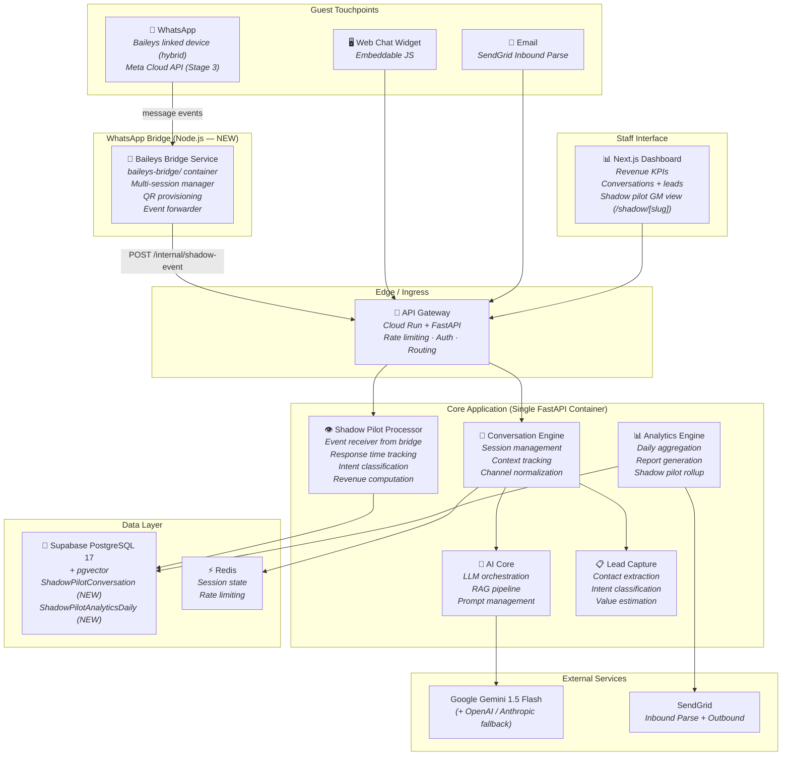
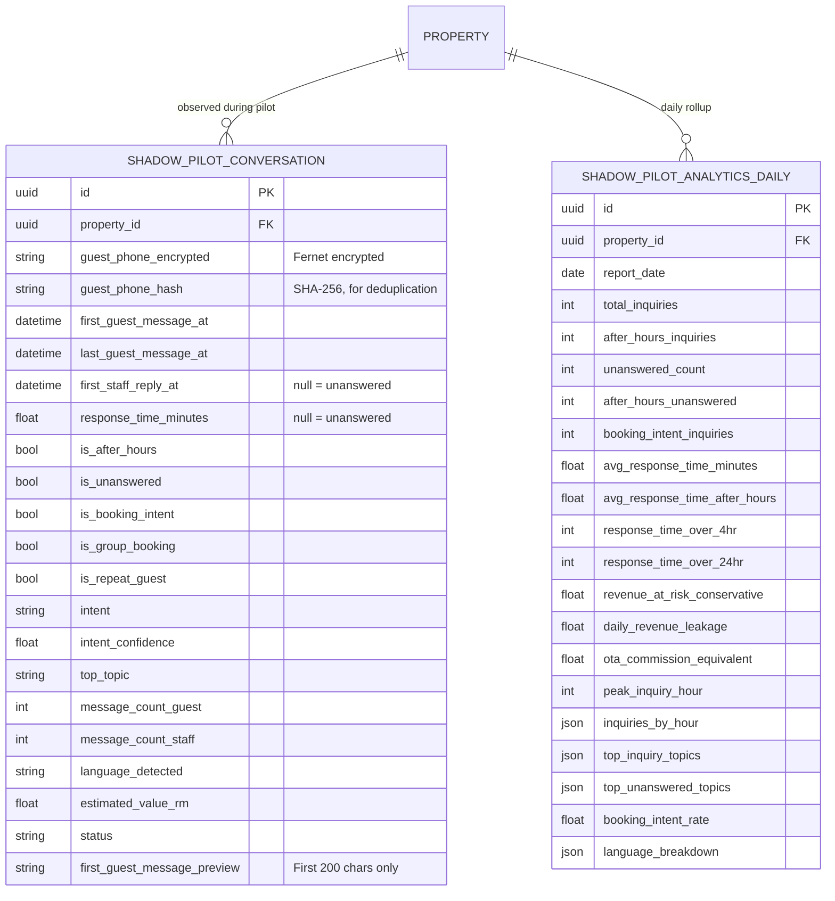
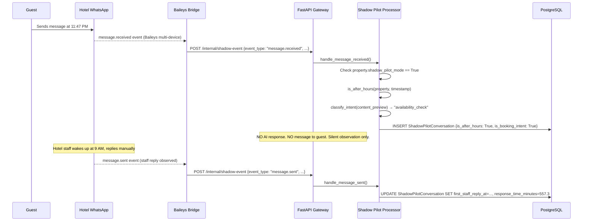

# System Architecture
## Nocturn AI — AI Inquiry Capture & Conversion Engine
### Version 2.5 · 24 Apr 2026
### Cross-referenced with: prd.md v2.5, build_plan.md v2.5, shadow_pilot_spec.md v1.0

---

## 1. Architecture Philosophy

This system is designed around **four non-negotiable constraints**:

1. **Guest latency < 30 seconds end-to-end.** Every architectural decision optimizes for this. A guest sends a WhatsApp message at 11pm and gets a useful answer before they switch to Booking.com.
2. **Property data isolation from Day 1.** Property A's data never leaks to Property B. This is a trust product — one leak and every hotel cancels.
3. **Operational simplicity over architectural elegance.** No microservices. No Kubernetes. One backend, one database, auto-scaling containers. One additional Node.js bridge service for WhatsApp.
4. **Observability from the start.** You cannot fix what you cannot measure. Structlog structured logging active. Alerts at 70% capacity thresholds.

---

## 2. High-Level Architecture



---

## 2.5 Three-Stage Funnel Architecture

```
┌─────────────────────────────────────────────────────────────────────────┐
│  Stage 1 — AUDIT (public, no auth, rate-limited)                        │
│                                                                         │
│  /audit (Next.js page, no auth)                                         │
│    → POST /api/v1/audit/calculate  (60/min per IP)                      │
│    → POST /api/v1/audit/submit     (5/min per IP)                       │
│    → AuditRecord saved to PostgreSQL                                    │
│    → Email within 60s (SendGrid) + SheersSoft notification              │
└──────────────────────────────┬──────────────────────────────────────────┘
                               │ SheersSoft AM offers shadow pilot
                               ▼
┌─────────────────────────────────────────────────────────────────────────┐
│  Stage 2 — SHADOW PILOT (Baileys linked device, shadow_pilot_mode=True) │
│                                                                         │
│  Property.shadow_pilot_mode = True                                      │
│  Property.shadow_pilot_phone = "+60XXXXXXXXXX" (hotel's REAL number)    │
│  Property.shadow_pilot_start_date = <date>                              │
│                                                                         │
│  Hotel's WhatsApp ← Baileys Bridge (observe only, zero messages sent)   │
│    → message.received / message.sent events → FastAPI                   │
│    → ShadowPilotConversation created/updated                            │
│    → is_after_hours flag set                                            │
│    → intent classified (BM + EN)                                        │
│    → response_time_minutes computed from staff reply timestamp          │
│    → is_unanswered = True after 24hr with no reply                      │
│                                                                         │
│  Cloud Scheduler (midnight) → run_shadow_pilot_aggregation              │
│    → ShadowPilotAnalyticsDaily computed (30+ metrics)                   │
│                                                                         │
│  Cloud Scheduler (Day 7) → run_shadow_pilot_weekly_report               │
│    → Weekly rollup computed → GM email sent                             │
│    → SheersSoft AM notified                                             │
│    → Token-gated dashboard available at /shadow/[slug]?token=[jwt]      │
└──────────────────────────────┬──────────────────────────────────────────┘
                               │ Day 7 call → GM agrees to co-pilot
                               ▼
┌─────────────────────────────────────────────────────────────────────────┐
│  Stage 2.5 — HYBRID CO-PILOT (Baileys, shadow_pilot_mode=False)         │
│                                                                         │
│  Property.shadow_pilot_mode = False                                     │
│  Property.audit_only_mode = False                                       │
│  Property.whatsapp_provider = "baileys"                                 │
│                                                                         │
│  Baileys bridge now ACTIVE: drafts + forwards AI replies via dashboard  │
│  Hotel staff: copy AI draft → paste into WhatsApp Business App          │
│  FPX/DuitNow payment link embedded in each draft                        │
└──────────────────────────────┬──────────────────────────────────────────┘
                               │ After 5+ paying pilots + Meta verification
                               ▼
┌─────────────────────────────────────────────────────────────────────────┐
│  Stage 3 — FULL AUTO (Meta Cloud API or official BSP)                   │
│                                                                         │
│  Property.whatsapp_provider = "meta" | "wati" | "360dialog"             │
│  Full AI response pipeline — no human in loop                           │
└─────────────────────────────────────────────────────────────────────────┘
```

---

## 2.6 Shadow Pilot Architecture Deep Dive (NEW — v2.5)

### 2.6.1 Why Linked Device, Not Separate Number

The previous design used a Twilio-provisioned secondary number for shadow pilots. This had two fatal flaws:

1. **Artificial data.** The hotel must actively promote the new number for guests to use it. The resulting traffic is a fraction of the real volume and is biased towards guests who specifically sought out the secondary channel.
2. **Sales friction.** Asking a hotel GM to change their WhatsApp bio and email footer for a proof-of-concept adds friction before value is demonstrated.

The linked device approach (Baileys) resolves both: the hotel's existing WhatsApp Business number is observed directly, producing irrefutable data from the hotel's real traffic.

### 2.6.2 Baileys Bridge — Deployment

The Baileys bridge runs as a separate Cloud Run service in the same GCP project:

```
Google Cloud Platform
├── Cloud Run (backend — FastAPI)     # Existing
├── Cloud Run (frontend — Next.js)    # Existing
└── Cloud Run (baileys-bridge — NEW)  # New in v2.5
    ├── Image: baileys-bridge:latest
    ├── Port: 3001
    ├── Memory: 512MB (sufficient for 5 concurrent sessions)
    ├── Min instances: 1 (must not cold-start — sessions would drop)
    ├── Volume mount: /sessions (Cloud Run Volume — see note below)
    └── Env: BACKEND_INTERNAL_URL, INTERNAL_SECRET
```

**Session persistence note:** Cloud Run volumes are ephemeral by default. Two options:
- **Option A (recommended for pilot)**: Use Cloud Storage FUSE mount for `/sessions`. Baileys auth state survives container restarts. ~RM 5/month.
- **Option B (simpler)**: Accept that sessions need re-scanning after container restarts. Admin panel detects session drops via heartbeat timeout and prompts AM to request re-scan.

For the founding cohort (≤5 pilots), Option B is acceptable. Option A is required at 10+ pilots.

### 2.6.3 Shadow Pilot Data Flow

```
[Hotel WhatsApp Business App]
        │  (normal operation — staff uses WhatsApp exactly as before)
        │
  WhatsApp Servers
        │  (multi-device protocol — supports up to 4 linked devices)
        │
[Baileys Bridge — linked device #2]
        │
        ├── message.received event (incoming guest message)
        │     ├── sender_jid: "60123456789@s.whatsapp.net"
        │     ├── content_preview: "Ada bilik tak weekend ni?" (first 200 chars)
        │     ├── timestamp_unix: 1714012800000
        │     └── has_media: false
        │
        └── message.sent event (outgoing staff reply)
              ├── recipient_jid: "60123456789@s.whatsapp.net"
              ├── content_preview: null  ← staff content NOT captured
              └── timestamp_unix: 1714034200000
                                  │
                                  │  POST /api/v1/internal/shadow-event
                                  ▼
                         [FastAPI — shadow_pilot_processor.py]
                                  │
                         ┌────────┴────────┐
                         ▼                 ▼
              ShadowPilotConversation    (on message.sent)
              created/updated           response_time_minutes computed
                         │
                         ▼
              (midnight Cloud Scheduler)
              run_shadow_pilot_aggregation
                         │
                         ▼
              ShadowPilotAnalyticsDaily
              (30+ metrics computed)
                         │
                         ▼
              (Day 7 Cloud Scheduler)
              run_shadow_pilot_weekly_report
                         │
                    ┌────┴────────────────────────────┐
                    ▼                                 ▼
             GM email                        SheersSoft AM
             (evidence report)               (call this GM today)
                    │
                    ▼
             /shadow/[slug]?token=[jwt]
             (token-gated dashboard — no login required)
```

### 2.6.4 Transport Abstraction (WhatsAppTransportInterface)

The same abstraction used for the hybrid co-pilot applies here. The shadow pilot is simply the `observe_only=True` mode of the same interface:

```python
# backend/app/services/whatsapp_transport.py

class WhatsAppTransportInterface(Protocol):
    async def send_message(self, to: str, text: str) -> bool: ...
    async def get_session_status(self, property_id: str) -> str: ...

class BaileysTransport:
    """
    Used for both shadow pilot (observe_only=True) and hybrid co-pilot (observe_only=False).
    When observe_only=True, send_message() is a no-op that logs a warning.
    The bridge handles observation regardless — the flag only gates whether
    the backend asks it to send.
    """
    def __init__(self, bridge_url: str, property_slug: str, observe_only: bool = False):
        self.bridge_url = bridge_url
        self.property_slug = property_slug
        self.observe_only = observe_only

    async def send_message(self, to: str, text: str) -> bool:
        if self.observe_only:
            logger.warning(
                "send_message called during shadow_pilot_mode=True — suppressed",
                property_slug=self.property_slug, to=to
            )
            return False
        # ... actual bridge call ...

class MetaCloudTransport:
    """Stage 3 — full Meta Cloud API auto-send"""
    ...

class TwilioTransport:
    """Legacy sandbox / testing only"""
    ...

def get_transport(prop: Property) -> WhatsAppTransportInterface:
    if prop.shadow_pilot_mode:
        return BaileysTransport(BRIDGE_URL, prop.slug, observe_only=True)
    match prop.whatsapp_provider:
        case "baileys": return BaileysTransport(BRIDGE_URL, prop.slug, observe_only=False)
        case "meta":    return MetaCloudTransport(prop.whatsapp_number, ...)
        case "twilio":  return TwilioTransport(prop.twilio_phone_number, ...)
```

---

## 3. Design Decisions & Rationale

### 3.1 Monolith-First (Single Backend Container)

Unchanged from v2.4. The Baileys bridge is a thin event relay, not a business logic service — it does not justify microservice complexity. It is a separate container only because it requires Node.js (Baileys is not available in Python).

### 3.1.1 Hybrid-First Design (Active)

Unchanged from v2.4. Full Meta Cloud API is now optional Stage 3.

### 3.2 PostgreSQL + pgvector

Unchanged from v2.4.

### 3.3 Redis for Session State

Unchanged from v2.4.

### 3.4 Channel Normalization Pattern

Unchanged from v2.4. Shadow pilot events from the Baileys bridge are NOT routed through the channel normalizer — they go directly to `shadow_pilot_processor.py`. The channel normalizer is only for the full co-pilot path.

### 3.5 Technical Debt Strategy

Unchanged from v2.4. Additional debt item:
- Baileys session persistence: Option B (ephemeral, re-scan on restart) is acceptable for pilot phase. Schedule migration to Cloud Storage FUSE mount before reaching 10 active shadow pilots.

---

## 4. Technology Stack

| Layer | Technology | Notes |
|---|---|---|
| **Backend API** | Python 3.12 + FastAPI | Unchanged |
| **WhatsApp Bridge (NEW)** | Node.js 20 + TypeScript + Baileys v6.7 | New container in v2.5 |
| **Database** | Supabase PostgreSQL 17 + pgvector | Two new tables: `shadow_pilot_conversations`, `shadow_pilot_analytics_daily` |
| **Cache / Sessions** | Redis 7 (graceful in-memory fallback) | Unchanged |
| **LLM Primary** | Google Gemini 1.5 Flash | Also used for shadow pilot intent classification |
| **LLM Fallback Chain** | OpenAI GPT-4o-mini → Anthropic Claude Haiku → template | Unchanged |
| **Staff Dashboard** | Next.js 14 (React) | New page: `/shadow/[slug]` (token-gated, no auth) |
| **Authentication** | Supabase Auth + local JWT | Shadow dashboard uses separate signed JWT (not Supabase) |
| **Infrastructure** | Google Cloud Run | +1 new service: `baileys-bridge` |

---

## 5. Data Architecture

### 5.1 Updated Entity Relationship Model

*Existing entities (Property, KnowledgeItem, Conversation, Message, Lead, AnalyticsDaily) are unchanged.*

**New entities in v2.5:**



### 5.2 Property Model Additions (v2.5)

```sql
ALTER TABLE properties
  ADD COLUMN IF NOT EXISTS shadow_pilot_mode BOOLEAN DEFAULT FALSE,
  ADD COLUMN IF NOT EXISTS shadow_pilot_start_date TIMESTAMPTZ,
  ADD COLUMN IF NOT EXISTS shadow_pilot_phone VARCHAR(30),
  ADD COLUMN IF NOT EXISTS shadow_pilot_session_active BOOLEAN DEFAULT FALSE,
  ADD COLUMN IF NOT EXISTS shadow_pilot_session_last_seen TIMESTAMPTZ,
  ADD COLUMN IF NOT EXISTS shadow_pilot_dashboard_token TEXT,
  ADD COLUMN IF NOT EXISTS shadow_pilot_dashboard_token_expires TIMESTAMPTZ,
  ADD COLUMN IF NOT EXISTS avg_stay_nights FLOAT DEFAULT 1.0;
```

### 5.3 Data Retention for Shadow Pilot

| Data | Retention | Notes |
|---|---|---|
| `ShadowPilotConversation.first_guest_message_preview` | 90 days after pilot ends | Purged by cleanup job |
| `ShadowPilotConversation.guest_phone_encrypted` | 90 days after pilot ends | Purged by cleanup job |
| `ShadowPilotConversation.guest_phone_hash` | 1 year | Used for repeat-guest analytics |
| `ShadowPilotAnalyticsDaily` | Indefinite | Aggregated stats only, no PII |
| Baileys session files (`/sessions/[slug]/`) | Until pilot ends + 7 days | Deleted when session stopped |

---

## 6. Core Processing Flows

### 6.1 Shadow Pilot Message Event Flow (NEW — v2.5)



### 6.2 Daily Aggregation Flow

```
Cloud Scheduler (midnight UTC)
  → POST /api/v1/internal/run-shadow-pilot-aggregation
  → For each property WHERE shadow_pilot_mode=True:
      → SELECT all ShadowPilotConversations for yesterday (property-local date)
      → Compute 30+ metrics
      → UPSERT ShadowPilotAnalyticsDaily
      → Mark conversations with no reply after 24hr as "abandoned"
```

### 6.3 Full Auto Flow (Stage 3 — unchanged from v2.4)

See v2.4 Section 6.1.1.

### 6.4 Human Handoff Flow (unchanged from v2.4)

See v2.4 Section 6.2.

---

## 7. AI / RAG Architecture

### 7.1–7.3 Unchanged from v2.4.

### 7.4 Shadow Pilot Intent Classification

The intent classifier in `shadow_pilot_classifier.py` reuses the existing LLM chain (`call_llm_simple`) with a minimal prompt. It runs asynchronously after the conversation record is created — it does not block the event processing.

Classification is cached in Redis for 1 hour keyed on SHA-256 of the message content, to prevent duplicate LLM calls if the same guest sends the same message to multiple properties.

---

## 8. API Design

### 8.1 New Endpoints (v2.5)

All new internal endpoints follow the existing `X-Internal-Secret` auth pattern.

```
# ── Baileys Bridge → Backend (internal) ─────────────────────────────────
POST   /api/v1/internal/shadow-event              # message.received / message.sent
POST   /api/v1/internal/shadow-session-status     # QR / connected / disconnected
POST   /api/v1/internal/shadow-heartbeat          # Session keepalive
GET    /api/v1/internal/shadow-active-properties  # Bridge startup: load active sessions

# ── Shadow pilot scheduled jobs ──────────────────────────────────────────
POST   /api/v1/internal/run-shadow-pilot-aggregation   # Daily metrics rollup
POST   /api/v1/internal/run-shadow-pilot-weekly-report # Day 7 GM email

# ── SuperAdmin (require_superadmin) ──────────────────────────────────────
POST   /api/v1/superadmin/shadow-pilots                # Provision new shadow pilot
GET    /api/v1/superadmin/shadow-pilots                # List all with 7-day summaries
GET    /api/v1/superadmin/shadow-pilots/{id}/qr        # Get QR code (proxied from bridge)
DELETE /api/v1/superadmin/shadow-pilots/{id}           # Stop and disconnect
GET    /api/v1/superadmin/shadow-pilots/{id}/analytics # Full daily analytics

# ── Token-gated GM dashboard (public — JWT token only) ───────────────────
GET    /api/v1/shadow/{property_slug}/summary          # Weekly rollup + daily data
```

---

## 9. Infrastructure & Deployment

### 9.1 Updated Cloud Architecture

```
Google Cloud Platform
├── Cloud Run (Backend API — FastAPI)              # Existing
├── Cloud Run (Staff Dashboard — Next.js)          # Existing
├── Cloud Run (Baileys Bridge — Node.js) [NEW]     # New in v2.5
│   ├── Image: gcr.io/nocturn-aai/baileys-bridge
│   ├── Port: 3001
│   ├── Memory: 512MB
│   ├── Min instances: 1 (no cold starts — sessions must persist)
│   └── Volume: /sessions (ephemeral for pilot, Cloud Storage at scale)
│
├── Supabase PostgreSQL 17 + pgvector              # Existing
│   └── +2 new tables: shadow_pilot_conversations, shadow_pilot_analytics_daily
│
└── Cloud Scheduler                                # +2 new jobs
    ├── shadow-pilot-daily-aggregation (0 0 * * *)
    └── shadow-pilot-weekly-report (0 8 * * 1)
```

### 9.2 Updated Deployment Pipeline

The `cloudbuild.yaml` must be updated to build and deploy the Baileys bridge container:

```yaml
# Add to backend/cloudbuild.yaml

steps:
  # ... existing backend and frontend steps ...

  # Build Baileys bridge
  - name: 'gcr.io/cloud-builders/docker'
    args: ['build', '-t', 'gcr.io/$PROJECT_ID/baileys-bridge:$COMMIT_SHA',
           './baileys-bridge']

  # Push Baileys bridge
  - name: 'gcr.io/cloud-builders/docker'
    args: ['push', 'gcr.io/$PROJECT_ID/baileys-bridge:$COMMIT_SHA']

  # Deploy Baileys bridge to Cloud Run
  - name: 'gcr.io/google.com/cloudsdktool/cloud-sdk'
    args:
      - 'run'
      - 'deploy'
      - 'baileys-bridge'
      - '--image=gcr.io/$PROJECT_ID/baileys-bridge:$COMMIT_SHA'
      - '--region=asia-southeast1'
      - '--min-instances=1'
      - '--max-instances=3'
      - '--memory=512Mi'
      - '--port=3001'
      - '--set-env-vars=BACKEND_INTERNAL_URL=https://[backend-url]'
      - '--set-secrets=INTERNAL_SECRET=INTERNAL_SECRET:latest'
```

### 9.3 Secret Manager Additions

Add the following secrets to GCP Secret Manager before the v2.5 deploy:

| Secret Name | Value | Notes |
|---|---|---|
| `BAILEYS_BRIDGE_URL` | `https://baileys-bridge-[hash]-as.a.run.app` | Internal URL of the bridge service |
| `INTERNAL_SECRET` | [random 32-char hex] | Already exists — shared with all internal endpoints |

---

## 10. Security & Compliance

### 10.1 Shadow Pilot-Specific Security

| Concern | Implementation |
|---|---|
| Guest phone number exposure | Fernet-encrypted at field level. Only `guest_phone_hash` used for logic. Plaintext never appears in logs, emails, or API responses. |
| Staff message content | **Never captured.** Bridge `message.sent` events forward only the timestamp and recipient JID — no message content. |
| Conversation preview content | `first_guest_message_preview` stores max 200 chars of guest's first message only. Auto-purged 90 days after pilot ends. Masked in emails (phone numbers replaced with `+60XXXXX12`). |
| Token-gated dashboard | Signed JWT (HS256). Payload contains only `property_id` and `exp`. Token does not grant any write access. |
| Baileys session files | Stored on Cloud Run ephemeral volume (not in database). Contains WhatsApp session keys — must not be exposed. Bridge service is internal-only (no public URL). |
| WhatsApp ToS | Shadow pilot is read-observe-only. Zero messages sent. Lowest-risk Baileys usage. Informed consent obtained from hotel GM at provisioning. |

### 10.2 PDPA Compliance (Shadow Pilot)

The shadow pilot observes a private communication channel on behalf of the hotel (business owner). The hotel GM provides informed consent at provisioning. Guests are communicating with the hotel's business WhatsApp — they have no expectation that this communication is private from the business owner. PDPA obligations (encryption, retention limits, deletion rights) are met per Section 10.1.

---

## 11. Scalability Considerations

The shadow pilot architecture adds negligible load to the existing system:

- **Baileys bridge**: 512MB handles ~20 concurrent linked sessions comfortably. Scale to 1GB at 50+ pilots.
- **`shadow-event` endpoint**: ~2–10 events per minute per active pilot. Negligible vs conversation engine load.
- **Intent classification**: Cached in Redis. Each unique message classified once. Cost: ~100 LLM calls/day across all active pilots.
- **ShadowPilotConversation writes**: Indexed on `property_id` + `first_guest_message_at`. B-tree index handles thousands of records trivially.

---

*v2.5 changes: Added Baileys Bridge service (Section 2.6), Shadow Pilot data flow (Section 6.1), two new database models, five new internal API endpoints, two new Cloud Scheduler jobs, updated deployment pipeline. All other sections unchanged from v2.4.*
